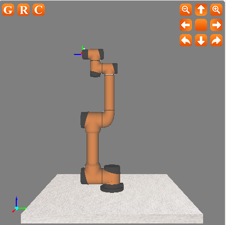

# Robotic_Contral_UDP
Send instructions through the data glove and send them to the virtual machine robot simulation teaching device through the udp protocol to control the movement of the robotic arm.

- result：
- 

